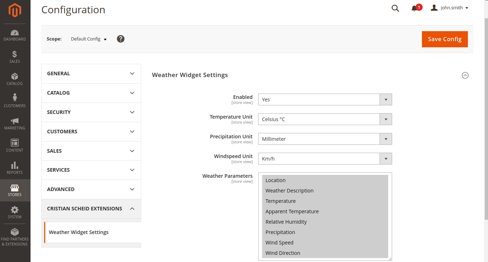

# Magento 2 - Weather Widget Module

## Description

The Weather Widget module seamlessly integrates real-time weather data into Magento-based applications, presented in an elegant and unobtrusive manner that enriches the user experience. By fetching current weather information based on visitors' IP addresses through external APIs, users enjoy immediate access to precise updates within the application. Furthermore, the module employs efficient caching mechanisms to enhance performance and reduce API calls, ensuring timely delivery of weather details without disrupting user interaction.


## Operation

The Weather Widget module operates on the following pages within Magento 2:

- catalog_category_view
- catalog_product_view
- catalogsearch_result_index
- cms_index_index

It updates its data every 15 minutes, utilizing a dual caching mechanism to enhance performance.

- Server Side: captures visitor IP address and queries both geolocation and weather APIs, caching their responses. This strategy significantly reduces server load and ensures rapid data retrieval for the frontend, which is delivered through a custom REST API. Geolocation API responses are cached for 24 hours, while weather data is refreshed and cached every 15 minutes.

- Client Side: utilizing browser local storage, the module stores the API response from Magento custom REST API and updates this data every 15 minutes. Even if users clear their local storage, switch to anonymous browsing tabs, or change browsers, the backend retains previously stored responses from external APIs. This eliminates the need for repeated API calls, providing users with a seamless and uninterrupted experience.

When data is updated, there is no need to refresh the browser, ensuring that users always have access to the latest weather information without any manual intervention.

## Disclaimer

This module was developed for educational purposes and is intended for non-commercial use only. The module leverages the following APIs, which are free for non-commercial use:

- [IP-API](https://ip-api.com/docs/) (for geolocation based on IP)
- [Open-Meteo API](https://open-meteo.com/en/docs) (for weather data)

Please ensure that your use of this module complies with the usage policies of these APIs. If you are interested in using this module for commercial purposes, feel free to reach out to me on [LinkedIn](https://www.linkedin.com/in/cristian-scheid/). I can adapt the module to work with the commercial versions of these APIs, including fields on the admin panel for entering API credentials.

## Installation

### Download

To download this module, select one of the options provided below:

1. Clone the repository using Git:
    ```
    git clone https://github.com/cristianscheid/magento2-weather-widget.git
    ```

2. Download it as a ZIP file:
    - Go to [https://github.com/cristianscheid/magento2-weather-widget](https://github.com/cristianscheid/magento2-weather-widget)
    - Click on `Code` > `Download ZIP`

### Folder structure

Once you have finished the download, you should have a `magento2-weather-widget` or `magento2-weather-widget-main` folder, dependening on the download option you chose. Copy its contents to the following directory:

`MagentoRootDir/app/code/CristianScheid/WeatherWidget/`

- Replace `MagentoRootDir` with the root directory of your Magento installation.
- Create the `CristianScheid` folder.
- Within the `CristianScheid` folder, create a `WeatherWidget` folder and paste the downloaded folder contents there.

### Module activation

From the root directory of your Magento installation, run:

    bin/magento module:enable CristianScheid_WeatherWidget
    bin/magento setup:upgrade
    bin/magento cache:clean

After that, the module should be activated and ready to use.

## Configuration

To configure the module, navigate to the store's admin panel and access `Stores` > `Configuration` > `Cristian Scheid Extensions` > `Weather Widget Settings`. You should see something like this:



Once you enable the module by setting `Enabled` to `Yes`, configuration options will appear. Simply choose your preferred measurement units and select the parameters you want displayed on the widget. After you've configured everything, click `Save Config` to apply your settings.